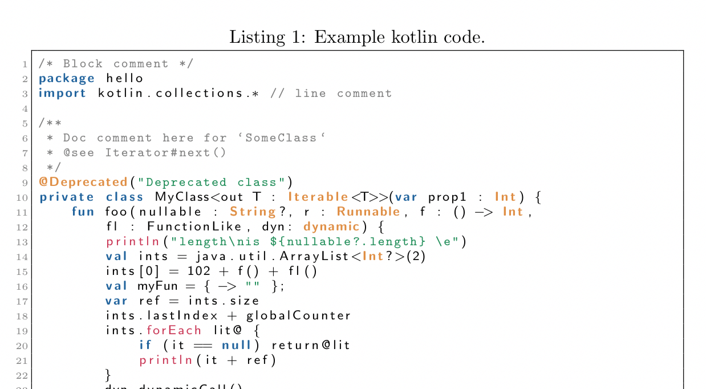
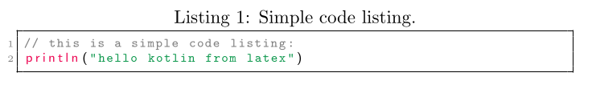

# Kotlin for LaTeX Listings
Currently, I am writing my bachelor thesis with [Kotlin](https://kotlinlang.org/) and need to document some code in [LaTeX](https://www.latex-project.org/). The [lstpackage](https://en.wikibooks.org/wiki/LaTeX/Source_Code_Listings) does not support kotlin syntax highlighting by default, so I decided to create a language template for it.



Check out this example of the default style or [download](example/kotlin_example.pdf) the whole document.

Feel free to add more keywords or new styles!

## How to use it?
First of all you have to copy the language definition into your latex document:

```latex
\usepackage[dvipsnames]{xcolor}
\usepackage{listings}

\lstdefinelanguage{Kotlin}{
  keywords={package, as, as?, typealias, this, super, val, var, fun, for, null, true, false, is, in, throw, return, break, continue, object, if, try, else, while, do, when, class, interface, enum, object, companion, override, public, private, get, set, import, abstract, vararg, expect, actual, where},
  keywordstyle=\color{NavyBlue}\bfseries,
  ndkeywords={@Deprecated, @JvmName, @JvmStatic, @JvmOverloads, @JvmField, @JvmSynthetic, Iterable, Int, Long, Integer, Short, Byte, Float, Double, String, Runnable, Array, dynamic},
  ndkeywordstyle=\color{BurntOrange}\bfseries,
  emph={println, return@, forEach, map, mapNotNull, first, filter, firstOrNull,},
  emphstyle={\color{OrangeRed}},
  identifierstyle=\color{black},
  sensitive=true,
  commentstyle=\color{gray}\ttfamily,
  comment=[l]{//},
  morecomment=[s]{/*}{*/},
  stringstyle=\color{ForestGreen}\ttfamily,
  morestring=[b]",
  morestring=[s]{"""*}{*"""},
}
```

Then you have to set the language of your listing to `Kotlin`:

```latex
\begin{lstlisting}[caption={Simple code listing.}, label={lst:example1}, language=Kotlin]
// this is a simple code listing:
println("hello kotlin from latex")
\end{lstlisting}
```

And finally your listing should look like this:

*(The border is not part of the language definition. Check out the [example.tex](example/kotlin_example.tex) for this style.)*
